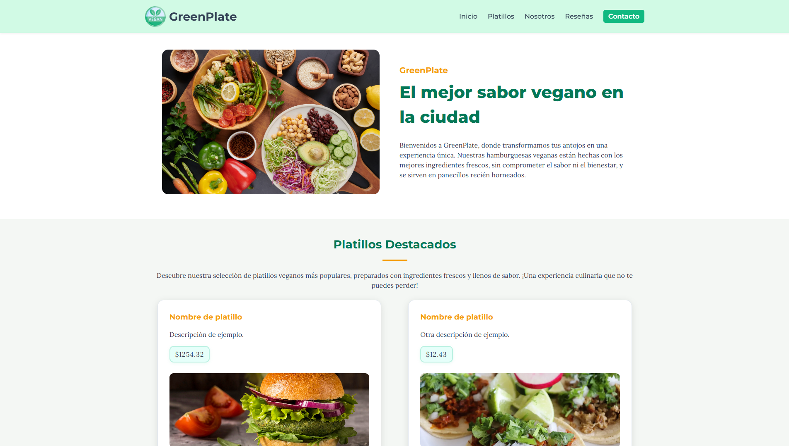
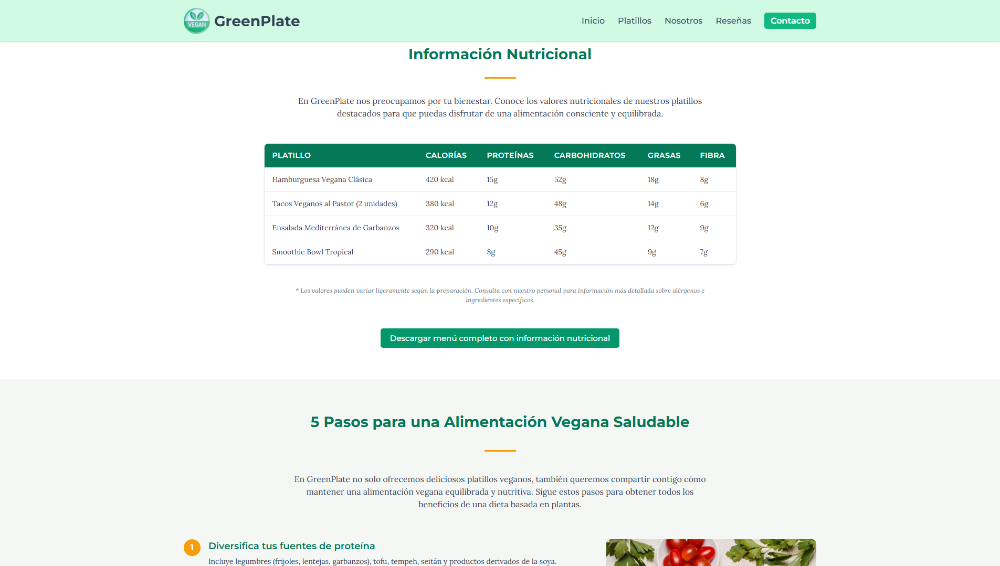
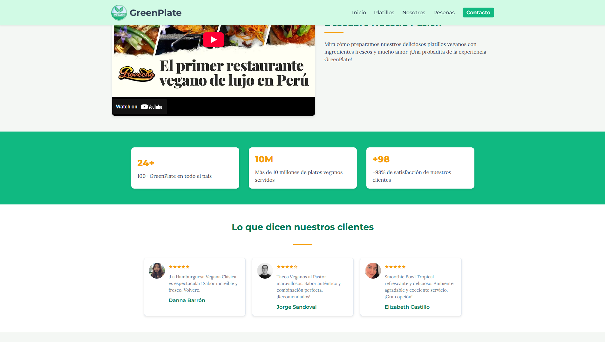
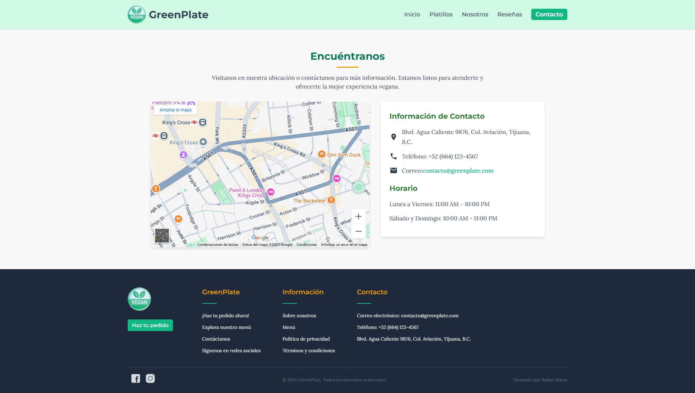
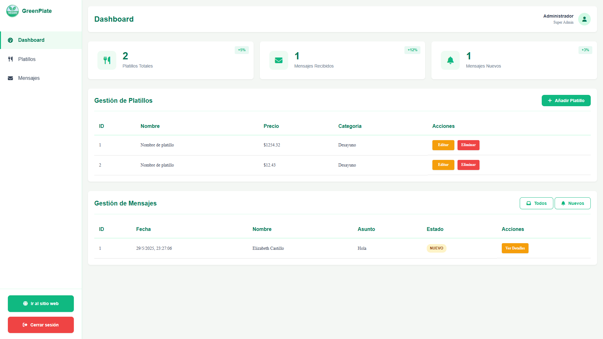

# GreenPlate

GreenPlate es una aplicación web completa para un restaurante ficticio. Permite a los visitantes explorar el menú, conocer la historia del restaurante y ponerse en contacto. Además, cuenta con un panel de administración protegido para gestionar los platillos ofrecidos.

## 🎨 Visualización del Proyecto

Aquí hay algunas capturas de pantalla que muestran la apariencia de la aplicación:

| Página Principal | Menú |
| :---: | :---: |
|  |  |

| Sobre Nosotros | Contacto |
| :---: | :---: |
|  |  |

| Login de Admin | Panel de Administración |
| :---: | :---: |
|  |  |


## 🚀 Tecnologías Utilizadas

Este proyecto está construido con un conjunto de tecnologías modernas y robustas:

-   **Frontend:**
    -   HTML5
    -   CSS3
    -   JavaScript
-   **Backend:**
    -   Node.js
    -   Express.js
-   **Base de Datos:**
    -   MySQL
-   **Servidor Web:**
    -   Nginx (como proxy inverso)
-   **Contenerización:**
    -   Docker
    -   Docker Compose

## 🛠️ Setup para Entorno Local

Sigue estos pasos para ejecutar el proyecto en tu máquina local.

### Prerrequisitos

Asegúrate de tener instalado [Docker](https://www.docker.com/get-started) y [Docker Compose](https://docs.docker.com/compose/install/) en tu sistema.

### 1. Clonar el Repositorio

```bash
git clone https://github.com/tu-usuario/GreenPlate.git
cd GreenPlate
```

### 2. Configurar las Variables de Entorno

Crea un archivo `.env` en la raíz del proyecto. Puedes copiar el archivo de ejemplo `.env.example` (si existe) o crearlo desde cero. Este archivo contendrá las credenciales y configuraciones sensibles.

```bash
cp .env.example .env
```

Abre el archivo `.env` y llénalo con tus propios valores. A continuación se muestra un ejemplo de cómo debería verse:

```dotenv
# Configuración de la base de datos MySQL (Docker)
MYSQL_ROOT_PASSWORD=tu_contraseña_root_mysql
MYSQL_DATABASE=greenplate_db
MYSQL_USER=gp_user
MYSQL_PASSWORD=tu_contraseña_de_usuario_mysql

# Configuración de la conexión a la base de datos para la aplicación
DB_HOST=mysql
DB_USER=greenplate_user
DB_PASSWORD=tu_contraseña_de_app_db
DB_NAME=greenplate_db

# Credenciales del administrador inicial
ADMIN_USER=admin
ADMIN_PASSWORD=tu_contraseña_de_admin
```

### 3. Construir y Ejecutar los Contenedores

Usa Docker Compose para construir las imágenes y levantar todos los servicios (Nginx, Servidor Node.js, Base de datos MySQL).

```bash
docker-compose up -d --build
```

El flag `-d` ejecuta los contenedores en segundo plano.

### 4. Acceder a la Aplicación

Una vez que los contenedores estén en funcionamiento, podrás acceder a la aplicación web en tu navegador:

-   **Sitio Principal:** [http://localhost](http://localhost)
-   **Panel de Administración:** [http://localhost/admin.html](http://localhost/admin.html)

Las credenciales para el panel de administración son las que definiste en las variables `ADMIN_USER` y `ADMIN_PASSWORD` en tu archivo `.env`.

### 5. Detener la Aplicación

Para detener todos los servicios, ejecuta:

```bash
docker-compose down
``` 